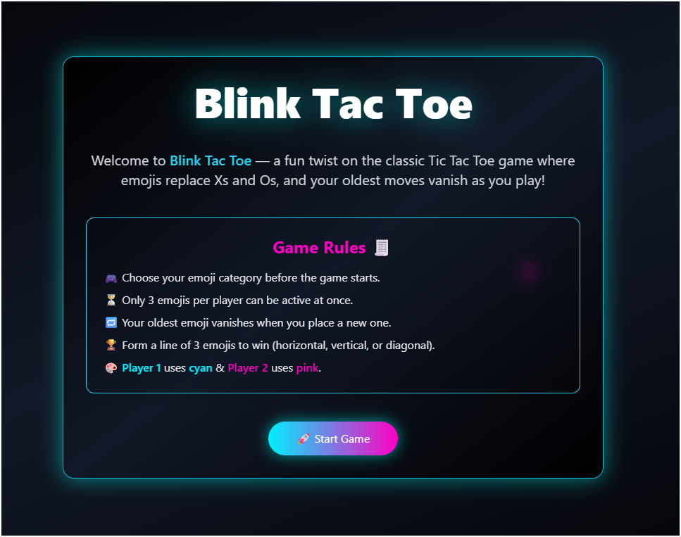
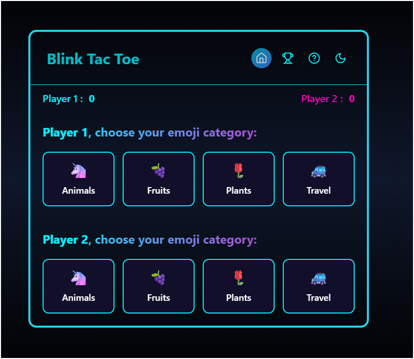
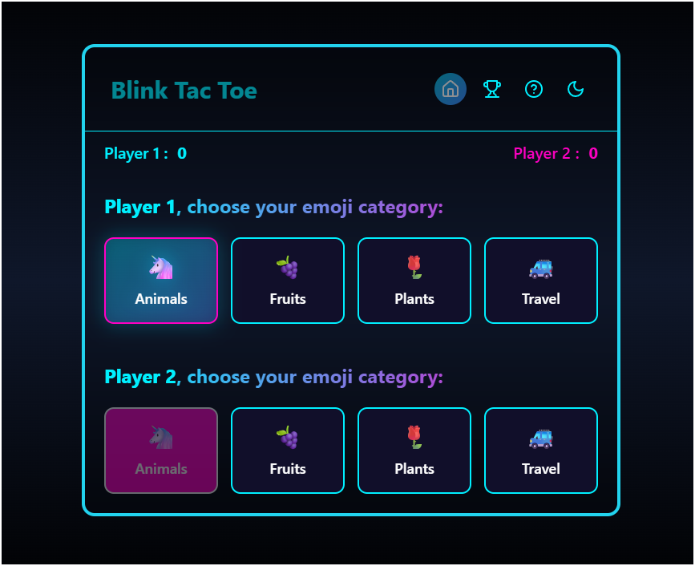
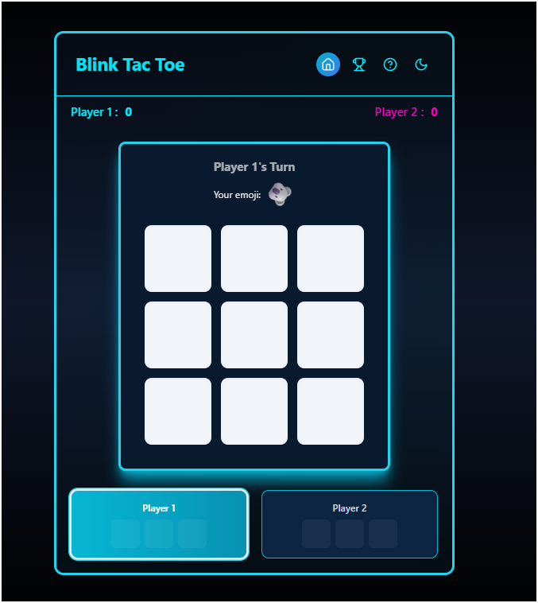
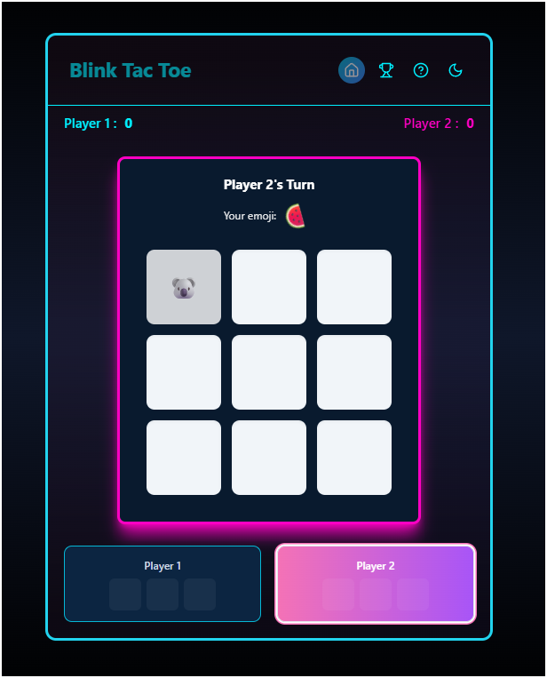
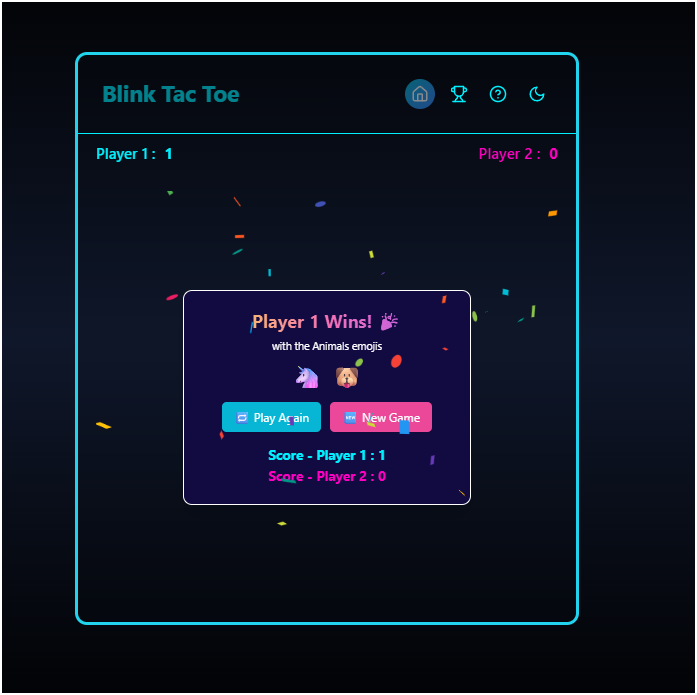
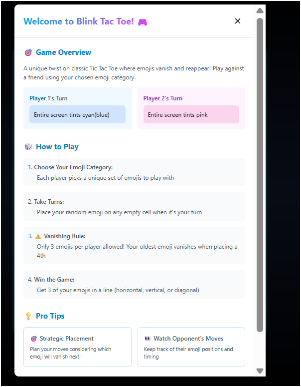
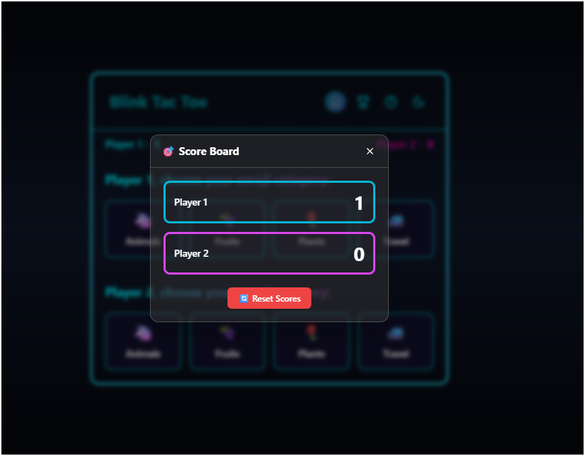
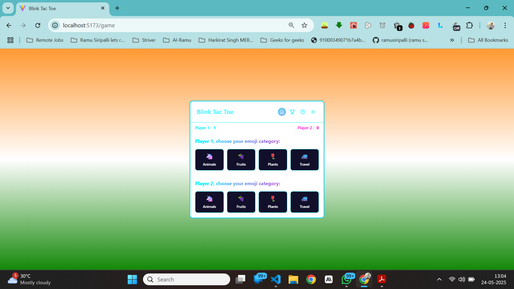
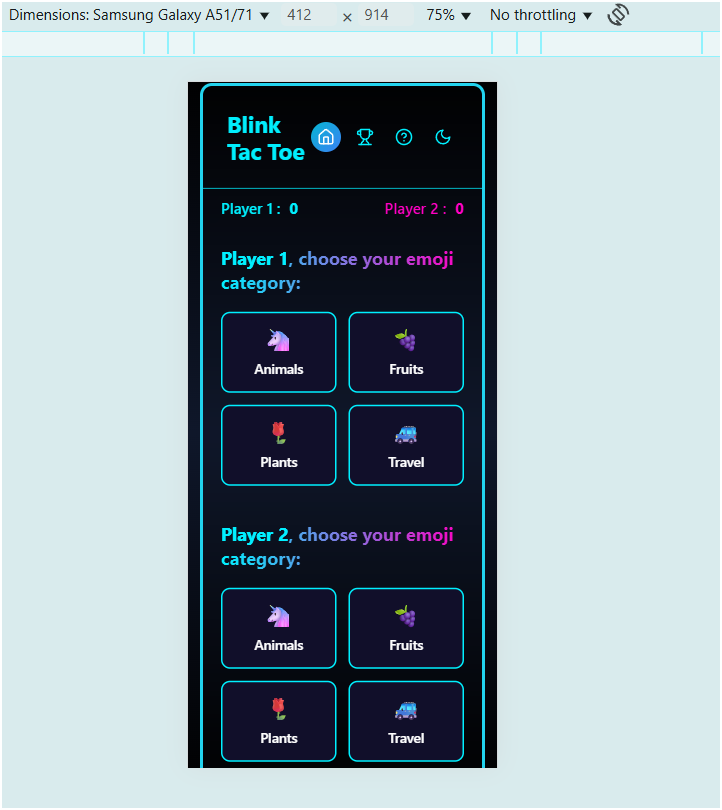

# 🎮 Blink Tac Toe

Welcome to **Blink Tac Toe** – a 2-player emoji twist on the classic Tic Tac Toe game with a *vanishing emoji* rule! Built for the Darban.ai Frontend Developer Challenge.

---

## 🛠 Tech Stack

- ⚛️ **React (Vite)**
- 💨 **Tailwind CSS** for styling
- 🎞 **Framer Motion, keyframes** for animations and transitions
- 🌐 **Deployed on** [Vercel](https://vercel.com)

---

## ✨ Features

- 🔁 **Vanishing Rule**: Each player has only 3 active emojis. The oldest disappears (FIFO).
- 🎨 **Player Color Identity**:
  - **Player 1** – `Cyan` (`#00f0ff`)
  - **Player 2** – `Pink` (`#ff00c3`)
- 🤖 **Emoji Categories**:
  - Animals: 🐶 🐱 🐵 🐰
  - Food: 🍕 🍟 🍔 🍩
  - Sports: ⚽️ 🏀 🏈 🎾
  - Custom categories supported!
- 🕹 Turn-based gameplay with visual turn indication
- 🧾 **Help modal** for first-time users
- 🏆 **Scoreboard**, Play Again, and Game Over screen
- 📱 Fully responsive (desktop & mobile)
- ⚡ Smooth transitions and animations

---

## 🔍 Game Logic

### ➤ Vanishing Emoji Logic
- Each player can place only **3 emojis** on the board at once.
- If a player tries to place a 4th emoji:
  - Their **oldest** emoji disappears (FIFO).
  - That cell **becomes reusable**, but not immediately in the same move.

### ➤ Win Conditions
- Line of **3 emojis** (horizontal, vertical, or diagonal)
- All 3 must belong to the **same player/category**
- No draws are possible — board can’t fill fully

---

## 🧪 Live Demo

👉 [Live Link (Vercel)](https://your-vercel-link.com)

---

## 📸 UI Screenshots

### 🏠 Home Page

### 🎮 Game Category Selection

### 🎮 Game Board 3 * 3 Grid Based on player colour

### 🧾 Game Over , Winners Display with Confetti

### 🧾 Help Rules 

### 🏆  Scoreboard

### 🏆  Light Theme Indian Flag Colour

### 🏆  Mobile Phone Responsivness

### 🚀 Setup Instructions

# Clone the repo
git clone https://github.com/your-username/blink-tac-toe.git
cd blink-tac-toe

# Install dependencies
npm install

# Run the development server
npm run dev

**🤔 Improvements with More Time**

🔊 Sound Effects — Add fun feedback for emoji placement and victory.

🧠 AI Mode — Challenge yourself against an AI player.

🌈 Theme Toggle — Auto switch between light/dark mode based on system preferences.

📈 Game History / Rounds — Track past wins and enable multi-round scorekeeping.

👨‍💻 Developed By
**Ramu Siripalli**
MERN Stack Developer | React Enthusiast

